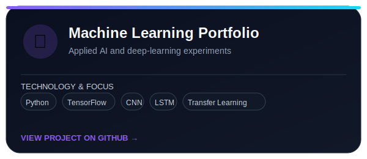
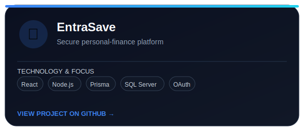
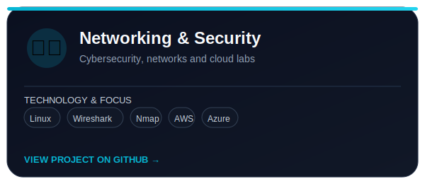
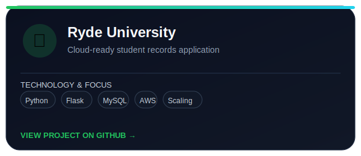

<!-- GitHub Profile README for github.com/jhoniex12 Update the links or wording whenever your portfolio and career details change. -->

<p align="center">  </p>


Hi, I'm Jhoniex 👋

Full-Stack, AI and Systems Developer based in Melbourne

I am a Master of Information Technology student at CQUniversity, specialising in Networks and Information Security with a minor in Artificial Intelligence. I enjoy building secure, practical and scalable software.

My work spans modern web applications, SaaS platforms, AI and machine-learning projects, backend architecture, infrastructure, and C++ game-engine modernisation.

<p align="center"> <a href="https://github.com/jhoniex12">  </a> <a href="https://www.linkedin.com/in/jhoniex12">  </a>  </p>


<br clear="right"/>

What I Build
Full-stack applications using React, Next.js, Node.js and TypeScript
Secure backend systems with REST APIs, OAuth, JWT and SQL Server
AI and machine-learning solutions using Python, TensorFlow and practical data workflows
SaaS platforms with multi-tenant architecture, authentication and production deployment
Systems and game-engine projects using C++, x64 migration and graphics-engine modernisation
Production infrastructure with Linux, Nginx, PM2, Cloudflare and CI/CD
Current Focus

Building software that is secure, maintainable, fast and useful.

```text
C++ Systems Development  ████████████████████  95%
Next.js + TypeScript     ███████████████████░  90%
Node.js + SQL Server     ███████████████████░  90%
AI / Machine Learning    █████████████████░░░  85%
Cloud + DevOps           ████████████████░░░░  80%
```


## Featured Public Projects

<table>
  <tr>
    <td width="50%">
      <a href="https://github.com/jhoniex12/MachineLearning-Portfolio">
        
      </a>
    </td>
    <td width="50%">
      <a href="https://github.com/jhoniex12/EntraSave">
        
      </a>
    </td>
  </tr>
  <tr>
    <td width="50%">
      <a href="https://github.com/jhoniex12/Networking-and-Security-Portfolio">
        
      </a>
    </td>
    <td width="50%">
      <a href="https://github.com/jhoniex12/RydeUniversity">
        
      </a>
    </td>
  </tr>
</table>

## Project Highlights
Project	What it demonstrates
Machine Learning Portfolio	CNN image classification, transfer learning, LSTM time-series forecasting and neural-network modelling
EntraSave	A responsive personal-finance platform with React, Node.js, Prisma, SQL Server, authentication and security-focused architecture
Networking and Security Portfolio	Cybersecurity labs, network analysis, cloud deployments, Linux, Wireshark, Nmap, AWS and Azure
Ryde University	A Flask and MySQL student-records application designed for AWS infrastructure and horizontal scaling
Selected Production and Systems Work
Project	Focus
EntraBook	Multi-tenant booking SaaS, organisation-based tenancy, authentication, payments and production deployment
BabyRan International	Game administration platform, secure APIs, account workflows and AI-assisted features
RAN Online Engine Upgrade	Win32-to-x64 migration, DirectX modernisation, performance profiling and C++ systems engineering
Web Projects	SEO-focused Next.js websites, accessibility, structured data and high Lighthouse performance.

## Technology Stack
### Languages

<p>  </p>

### Frontend and Backend

<p>  </p>

### Data, Infrastructure and Tools

<p>  </p>

I primarily work with Microsoft SQL Server. The database icon above represents my broader relational-database experience.

##  Engineering Strengths
### Architecture:
  - secure authentication and authorisation
  - multi-tenant SaaS design
  - REST API and database design
  - modular and maintainable codebases

### Quality:
  - accessibility and responsive design
  - SEO and performance optimisation
  - validation, testing and documentation
  - security-first implementation

### Problem solving:
  - debugging complex systems
  - modernising legacy applications
  - performance analysis
  - translating requirements into working software

## GitHub Activity

<p align="center">  </p>

## Learning and Career Direction

I am continuing to deepen my skills in:

AI agents and workflow automation
Machine learning and model deployment
Cloud architecture and DevOps
Secure and scalable application design
High-performance C++ and graphics systems

I am interested in opportunities where I can contribute as a Junior Software Developer, Full-Stack Developer, AI Developer or Automation Engineer while continuing to grow through real-world engineering challenges.

## Let's Connect

<p align="center"> <a href="https://www.linkedin.com/in/jhoniex12">  </a> <a href="https://github.com/jhoniex12">  </a> </p>

<p align="center"> <em>Deep thinking, continuous learning and practical problem-solving.</em> </p>

<p align="center">  </p>

I am interested in opportunities as a **Junior Software Developer, Full-Stack Developer, AI Developer or Automation Engineer**.

---

<p align="center">
  <strong>Deep thinking · Continuous learning · Practical problem-solving</strong>
</p>
