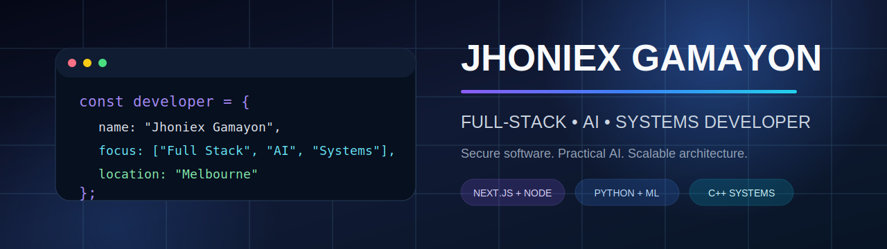

<p align="center">
  
</p>

<p align="center">
  
</p>

<h1 align="center">Hi, I'm Jhoniex 👋</h1>

<p align="center">
  <strong>Full-Stack, AI and Systems Developer based in Melbourne</strong>
</p>

<p align="center">
  Master of Information Technology student at CQUniversity, specialising in
  Networks and Information Security with a minor in Artificial Intelligence.
</p>

<p align="center">
  <a href="https://github.com/jhoniex12">GitHub</a>
  ·
  <a href="https://www.linkedin.com/in/jhoniex12">LinkedIn</a>
</p>

## About Me

I build secure, practical and scalable software across web development, SaaS, AI and machine learning, backend architecture, infrastructure, and C++ systems engineering.

- Building full-stack applications with **React, Next.js, Node.js and TypeScript**
- Designing secure APIs with **OAuth, JWT, validation and SQL Server**
- Developing practical AI and machine-learning projects with **Python and TensorFlow**
- Deploying production services with **Linux, Nginx, PM2 and Cloudflare**
- Modernising legacy systems through **C++, x64 migration and performance profiling**

## Featured Projects

<table>
  <tr>
    <td width="50%">
      <a href="https://github.com/jhoniex12/MachineLearning-Portfolio">
        
      </a>
    </td>
    <td width="50%">
      <a href="https://github.com/jhoniex12/EntraSave">
        
      </a>
    </td>
  </tr>
  <tr>
    <td width="50%">
      <a href="https://github.com/jhoniex12/Networking-and-Security-Portfolio">
        
      </a>
    </td>
    <td width="50%">
      <a href="https://github.com/jhoniex12/RydeUniversity">
        
      </a>
    </td>
  </tr>
</table>

## Selected Production and Systems Work

| Project | Engineering focus |
|---|---|
| **EntraBook** | Multi-tenant booking SaaS, organisation-based tenancy, authentication, payments and production deployment |
| **BabyRan International** | Game administration platform, secure APIs, account workflows and AI-assisted features |
| **RAN Online Engine Upgrade** | Win32-to-x64 migration, DirectX modernisation, performance profiling and C++ systems engineering |
| **WebAlive Projects** | SEO-focused Next.js websites, accessibility, structured data and high Lighthouse performance |

## Technology Stack

**Languages**

`TypeScript` `JavaScript` `Python` `C++` `SQL` `HTML` `CSS`

**Frontend and Backend**

`React` `Next.js` `Node.js` `Express` `Vite` `Tailwind CSS` `Prisma`

**Data and Infrastructure**

`Microsoft SQL Server` `MySQL` `Linux` `Nginx` `PM2` `Cloudflare` `Docker`

**Engineering Tools**

`Git` `GitHub` `GitHub Actions` `VS Code` `Visual Studio` `Postman`

## Engineering Strengths

```yaml
architecture:
  - secure authentication and authorisation
  - multi-tenant SaaS design
  - REST API and database design
  - maintainable application structure

quality:
  - accessibility and responsive design
  - SEO and performance optimisation
  - testing and technical documentation
  - security-first implementation

problem_solving:
  - debugging complex systems
  - modernising legacy applications
  - performance analysis
  - translating requirements into working software
```

## Current Direction

I am continuing to deepen my skills in AI agents, workflow automation, model deployment, cloud architecture, DevOps, secure application design, and high-performance C++ systems.

I am interested in opportunities as a **Junior Software Developer, Full-Stack Developer, AI Developer or Automation Engineer**.

---

<p align="center">
  <strong>Deep thinking · Continuous learning · Practical problem-solving</strong>
</p>
